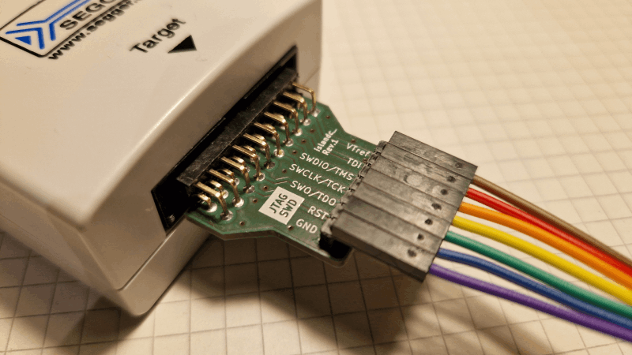
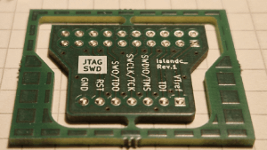
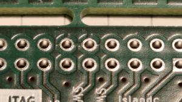
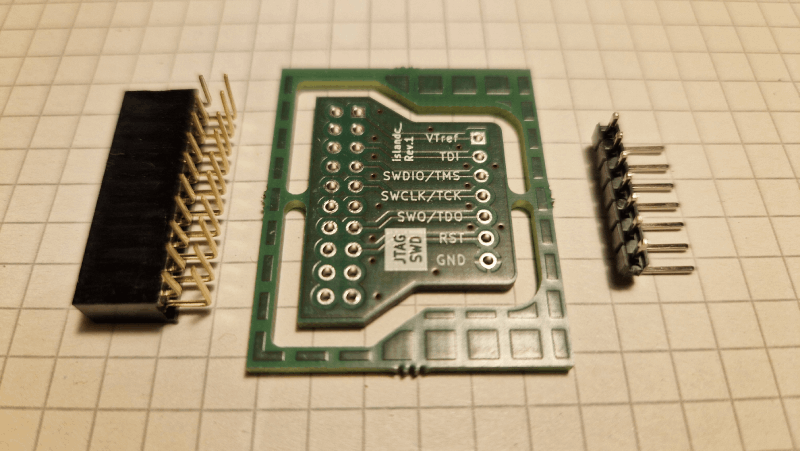

# jtag-wire-adapter

A compact adapter board for connecting SEGGER J-Link debug probes to generic JTAG/SWD targets using a set of flying wires.

View [**Schematic**](doc/sch_jtag-wire-adapter_rev1.pdf) &#128196; or [**PCB Preview**](https://htmlpreview.github.io/?https://github.com/islandcontroller/jtag-wire-adapter/blob/master/doc/ibom.html) &#127760;.

### Key features

* Snug-fit debug probe connector
* .100" pin header for flying wire connection
* Signal assignment printed on silk screen

Interested? Click the button below to push this project to AISLER and get your PCB fabricated.

## Overview

This adapter can be used to interface a SEGGER J-Link debug probe to a generic JTAG or SWD target, using .1" *DuPont*-style jumper wires. This low cost solution can be especially useful for academic users of J-Link EDU probes, as it doesn't require special connector hardware to be fitted on target project boards.

## BOM

The parts are generic and can be found pretty much anywhere on the internet.

| Designator | Description                                             |
|------------|---------------------------------------------------------|
| `J1`       | Right-angle socket header, 2x10 contacts, .100" spacing |
| `J2`       | Right-angle pin header, 1x7 contacts, .100" spacing     |

## Design Review and Validation

Prototype PCBs were fabricated in the EU at [**AISLER B.V.**](https://aisler.net/) using their integrated KiCad plugin. See [photos](#photos) for further details.

* The selected stacked-row header seems to be *just* short enough to accidentally fit with a column offset. A wider connector should be selected to prevent wrong connection.

A tool compatibility test was performed using a SEGGER J-LinkEDU emulator and a "blue pill"-type STM32 board.

## Photos

<a href="doc/pcb2.jpg">&ensp;&nbsp;&ensp;</a>

## Licensing

If not stated otherwise within the specific file, the contents of this project are licensed under the CERN Open Hardware Licence Version 2 - Permissive. The full license text is provided in the [`LICENSE`](LICENSE) document.

        SPDX-License-Identifier: CERN-OHL-P-2.0

This licensing model is compliant with the [Open Source Hardware Definition 1.0](https://www.oshwa.org/definition/).