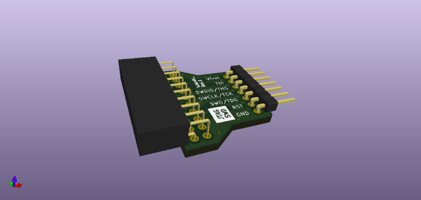

# jtag-wire-adapter

A compact adapter board for connecting SEGGER J-Link debug probes to generic JTAG/SWD targets using a set of flying wires.

Show the [**PCB Preview**](https://htmlpreview.github.io/?https://github.com/islandcontroller/jtag-wire-adapter/blob/master/doc/ibom.html) &#127760;.

### Key features

* Snug-fit debug probe connector
* .100" pin header for flying wire connection
* Signal assignment printed on silk screen

## Overview

This adapter can be used to interface a SEGGER J-Link debug probe to a generic JTAG or SWD target, using .1" *DuPont*-style jumper wires. This low cost solution can be especially useful for academic users of J-Link EDU probes, as it doesn't require special connector hardware to be fitted on target project boards.

## Licensing

If not stated otherwise within the specific file, the contents of this project are licensed under the CERN Open Hardware Licence Version 2 - Permissive. The full license text is provided in the [`LICENSE`](LICENSE) document.

        SPDX-License-Identifier: CERN-OHL-P-2.0

This licensing model is compliant with the [Open Source Hardware Definition 1.0](https://www.oshwa.org/definition/).